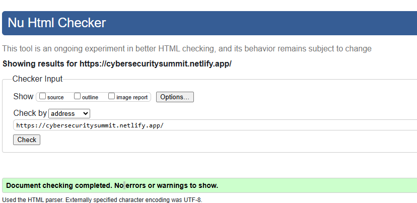
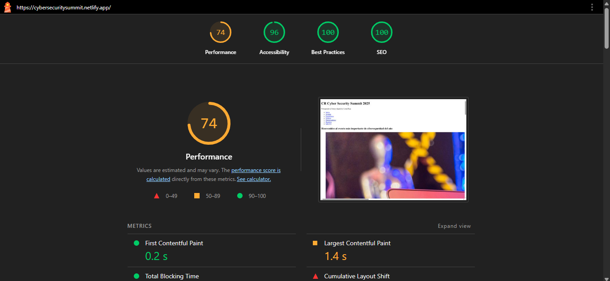

# CR Cyber Security Summit 2023 🛡️

Sitio web oficial del evento de ciberseguridad más importante de Costa Rica. Desarrollado con HTML semántico, accesibilidad y buenas prácticas SEO.


## **Estructura Semántica**
Etiquetas clave utilizadas y su propósito:

| Etiqueta          | Uso                                                                 |
|-------------------|---------------------------------------------------------------------|
| `<header>`        | Cabecera con logo y menú de navegación.                             |
| `<nav>`           | Menú principal con enlaces internos/externos.                       |
| `<main>`          | Contenido principal del sitio (secciones del evento).               |
| `<section>`       | Divide las áreas temáticas (Agenda, Talleres, etc.).                |
| `<article>`       | Contenido independiente (ej: panel de expertos).                    |
| `<figure>`        | Agrupa imágenes con su descripción (`<figcaption>`).                |
| `<aside>`         | Información complementaria (ej: transporte al evento).              |
| `<footer>`        | Pie de página con contacto y derechos.                              |

---

## **URL Pública en Netlify**
🔗 [https://cybersecuritysummit.netlify.app/](https://cybersecuritysummit.netlify.app/)  

---

## **Validación W3C**
 **Resultado:** 0 errores, 0 advertencias.  
 *Captura de pantalla:*  
  

---

## **Resultados Lighthouse**  
  

### **Puntuaciones:**
- **Performance:** 74 (Necesita mejora en carga de imágenes externas).  
- **Accessibility:** 96 (Excelente, pero se puede optimizar contraste en textos).  
- **Best Practices:** 100 (Sin problemas detectados).  
- **SEO:** 100 (Optimizado para motores de búsqueda).  

### **Métricas Clave:**
- **First Contentful Paint:** 0.2 s  
- **Largest Contentful Paint:** 1.4 s  

### **Plan de Mejoras:**
1. **Optimizar imágenes:** Compresión sin pérdida para reducir tiempos de carga.  
2. **Precargar recursos críticos:** Usar `<link rel="preload">` para fuentes/scripts.  
3. **Mejorar contraste:** Revisar colores en textos para cumplir WCAG AA.  

---

## **Accesibilidad Aplicada**  
### **1. `tabindex`**
- `tabindex="0"`: Imagen principal (para focuseable con teclado).  
- `tabindex="-1"`: Imagen de agenda (excluida del tabulado).  

### **2. Atributos ARIA**
- `aria-label="Menú principal"`: En `<nav>` para describir su función.  
- `aria-labelledby="form-heading"`: En formulario para asociarlo a su título.  

### **3. Textos alternativos (`alt`)**
- Todas las imágenes incluyen `alt` descriptivo (ej: "Personas en taller de hacking ético").  

### **4. Enlaces descriptivos**
- Evita "clic aquí". Ejemplo:  
  ```html
  <a href="https://www.micitt.go.cr">MICITT (Ministerio de Ciencia)</a>